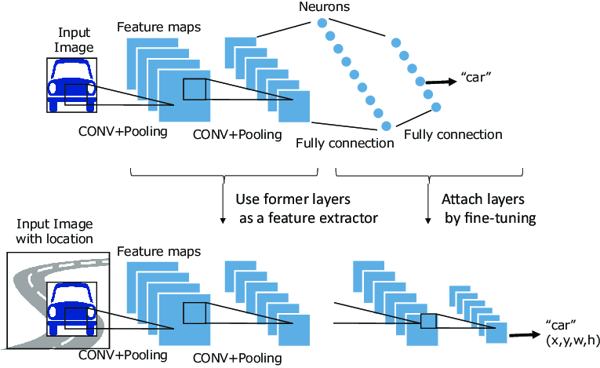
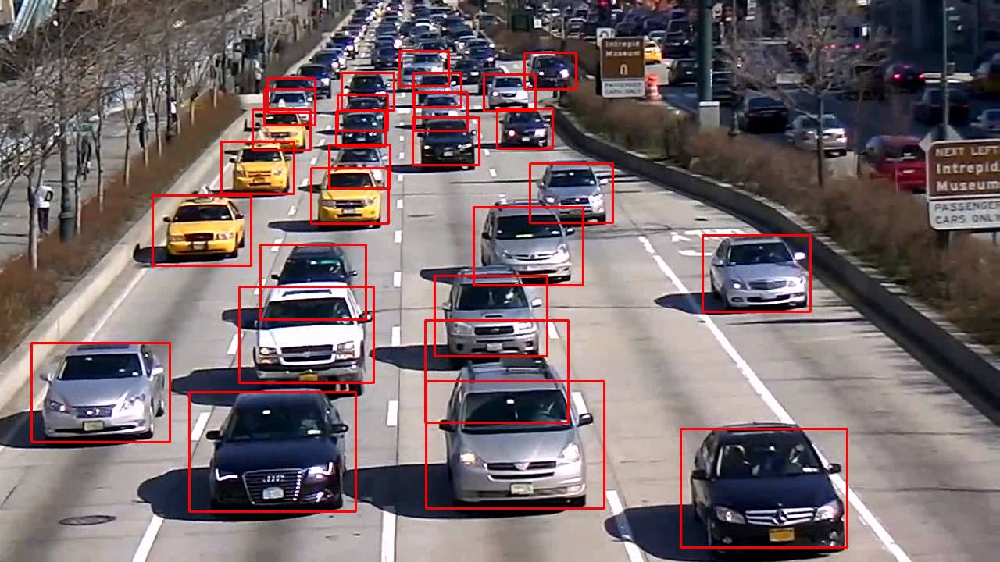

<h1 align="center">
  YOLOV2
</h1>
 
 

  

Implemented the actual Yolov2 paper with exactly the same parameters. Implemented IOU metric, non-max suppression and Filer boxes modules. Frameworks used : Tensorflow and Keras.

YOLO ("you only look once") is a popular algoritm because it achieves high accuracy while also being able to run in real-time. This algorithm "only looks once" at the image in the sense that it requires only one forward propagation pass through the network to make predictions. After non-max suppression, it then outputs recognized objects together with the bounding boxes.

  

